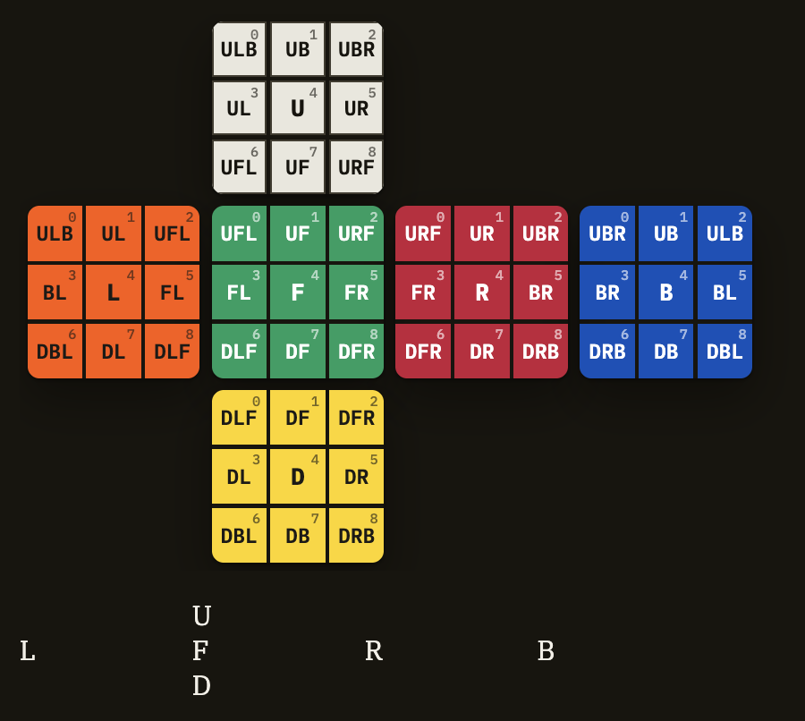

# Cube Notation — Cubie Names, Facelet Indices, Twists & Flips

*(Part of the Rubik prep docs — see `00-overview.md` for the index and `GLOSSARY.md` for term definitions. This file is the concrete companion to §3.0 of `02-algorithms.md`: that section introduces the *cubie* and *facelet* models in the abstract; this one gives every piece and every sticker its actual name, so you can read solver code and papers — including Kociemba's own — without translating in your head.)*

## 1. Fix your reference frame first

`U`, `R`, `F`, `D`, `L`, `B` are positions in space, not colours. Before any of the naming below means anything, you (and your teammate) need to agree, once, on which physical face is `U` and which is `F` — everything else follows automatically:

- Pick a face to be `U` (up), and an adjacent face to be `F` (front).
- Hold the cube that way. `R` is to your right, `L` to your left, `D` is the bottom, `B` is the back.

The actual colours don't matter to the algorithm — only that the two of you use the *same* frame everywhere (input parsing, the renderer, test fixtures). If you want your output to be eyeballable against reference solvers and speedcubing tools, use the WCA convention: **White = U, Green = F** (which fixes Yellow = D, Blue = B, Red = R, Orange = L). There's no requirement to use it, but it saves you re-deriving "which way is up" every time you compare your output to something online.

## 2. The 26 movable cubies

Centres are fixed relative to each other and mostly ignored by the solver (see *Cubie* in the glossary) — but they still need names, since the renderer and the facelet model use them.

**6 centres** — named after their own face:

```
U   R   F   D   L   B
```

**8 corners** — named by the three faces they touch, top layer then bottom layer:

```
URF   UFL   ULB   UBR
DFR   DLF   DBL   DRB
```

**12 edges** — named by the two faces they touch, top layer, bottom layer, then middle layer:

```
UR   UF   UL   UB
DR   DF   DL   DB
FR   FL   BL   BR
```

These are the exact names Kociemba's own two-phase implementation and most solver literature use — worth reading fluently rather than re-deriving, since `07-defence-prep.md` assumes you can point at a cubie and name it on sight.

## 3. Facelet indexing — the 54-sticker view

The *facelet model* (§3.0 of `02-algorithms.md`) numbers each face's 9 stickers `0`–`8`, left-to-right then top-to-bottom, with the face laid out on the standard unfolded net:

```
          U
    L     F     R     B
          D
```

(`U`'s bottom edge touches `F`'s top edge when folded up; `D`'s top edge touches `F`'s bottom edge; and so on around the net.)

Because a corner touches 3 faces and an edge touches 2, every facelet index on every face belongs to a specific cubie. This is the full lookup table — it's the one thing in this file worth keeping open in a second tab while you write `facelet.c`:

| idx | U | R | F | D | L | B |
|---|---|---|---|---|---|---|
| 0 | ULB | URF | UFL | DLF | ULB | UBR |
| 1 | UB | UR | UF | DF | UL | UB |
| 2 | UBR | UBR | URF | DFR | UFL | ULB |
| 3 | UL | FR | FL | DL | BL | BR |
| 4 | **U** | **R** | **F** | **D** | **L** | **B** |
| 5 | UR | BR | FR | DR | FL | BL |
| 6 | UFL | DFR | DLF | DBL | DBL | DRB |
| 7 | UF | DR | DF | DB | DL | DB |
| 8 | URF | DRB | DFR | DRB | DLF | DBL |

Row 4 (the centre) is bolded because it's the one row where the cubie name and the face letter are identical — an easy thing to eyeball-check if you've made a mistake elsewhere in the table.

### The 54-character state string

Concatenating the columns in order — `U0..U8, R0..R8, F0..F8, D0..D8, L0..L8, B0..B8` — gives a single 54-character string, one character per facelet, each holding the *colour currently showing there*. This is Kociemba's canonical string order, and it's the format most reference solvers, test vectors, and online "type in your scramble" tools expect — worth matching exactly if you ever want to sanity-check your solver's output against one of them.

## 4. Corner orientation — twist `0` / `1` / `2`

Each corner has 3 facelets. One of them is its "U/D-type" sticker — the one that belongs on a `U` or `D` face when the cube is solved. **Twist** counts how many clockwise steps that sticker is away from actually facing `U`/`D`:

- `0` — U/D-type sticker faces `U` or `D`. Correctly oriented.
- `1` — rotated one click clockwise.
- `2` — rotated two clicks clockwise (equivalently, one click counter-clockwise).

*Invariant* (already in the glossary, worth repeating here because it's the natural assertion for a unit test): summed across all 8 corners, twist values mod 3 always equal `0` — on a solved cube, and after any legal move sequence. If that sum is ever non-zero, either your move table or your test scramble is wrong, and it's worth checking before you look anywhere else.

## 5. Edge orientation — flip `0` / `1`

Each edge has 2 facelets, one of which is its reference sticker. The definition is fiddlier to state from first principles than the corner one, but there's a rule that's simple to implement and matches the standard convention: **quarter turns of `F` or `B` flip the orientation of the 4 edges they move; `U`, `D`, `L`, `R` never do.** Track flip incrementally as you apply moves, using that rule, and you don't need a from-scratch geometric definition at all.

(If you've done any speedcubing, this is the same "EO" — edge orientation — concept used before block-building methods; not a coincidence, since it's the same underlying group-theory fact Kociemba's phase 1 goal state depends on.)

*Invariant*: summed across all 12 edges, flip values mod 2 always equal `0`. Same use as the corner invariant above — assert it after every move application in your tests.

## 6. Where this lands in the code

Ties directly to `04-architecture.md`'s module layout: `cube/cubie.c` is where corner/edge permutation + these orientation values live as the authoritative model; `cube/facelet.c` is the conversion layer between that and the 54-character string above, needed by both input parsing and the renderer. If a test ever disagrees with a reference implementation, the first thing to check is whether both sides are using this same facelet order and the same `U`/`F` reference frame — a silent mismatch there produces a cube that *looks* subtly wrong in every test without any single obviously-broken function.

